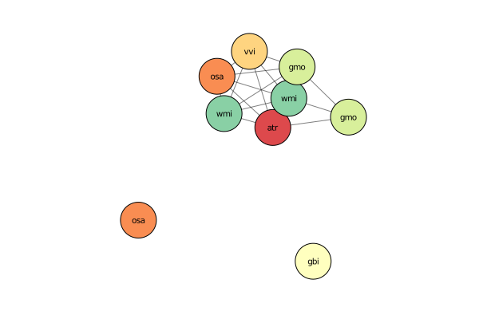

# TaoNet

This module currently implements a simulation algorithm for a simple Markov model of the evolution of *gene family syntenic networks*. It simulates the synteny graph (sensu Zhao & Schranz 2018) in stages across a given a dated species tree using a Gillespie-like algorithm. The continuous time Markov model includes the following events:

1. gene duplication at *per-gene* duplication rate `λ`
2. gene loss at *per gene* loss rate `μ`
3. rearrangement at *per gene* rearrangement rate `ν`

Two more parameters are defined in the simple model:

1. the probability an edge of a node is retained upon rearrangement `pr`
2. the probability an edge of a parent node is copied to a duplicated node `pd`

In the present implementation, the latter two parameters are not set directly, but assigned a Beta prior distribution from which `pr` and `pd` are randomly sampled independently for each event.

## Usage

This is a julia package, and was developed using julia 1.4. To install the package open a julia REPL (type `julia` in a terminal window), then enter the package manager by typing `]` and execute the following lines

```
add https://github.com/arzwa/NewickTree.jl#master
add https://github.com/arzwa/TaoNet.jl#master
```

You might also want to `add Plots`

## Example
Note that `Plots` can take a long time to load...

```julia
using NewickTree, TaoNet, Plots, Random, Distributions
Random.seed!(195);
```

Get the species tree

```julia
t = readnw("(((atr:2.47,(osa:1.82,vvi:1.82):0.65):0.91,(gbi:2.90,"*
    "(gmo:1.77,wmi:1.77):1.13):0.48):0.80,(afi:0.89,scu:0.89):3.31);")
```
```
(((atr:2.47,(osa:1.82,vvi:1.82):0.65):0.91,(gbi:2.9,(gmo:1.77,wmi:1.77):1.13):0.48):0.8,(afi:0.89,scu:0.89):3.31);
```

Now define the model

```julia
tn = SimpleTaoNet(λ=0.2, μ=0.15, ν=0.05, pr=Beta(1,5), pd=Beta(1,5))
```
```
SimpleTaoNet{Float64,TaoNet.ShiftedGeometric{Float64}}
  λ: Float64 0.2
  μ: Float64 0.15
  ν: Float64 0.05
  q: Array{Float64}((0,)) Float64[]
  pr: Beta{Float64}
  pd: Beta{Float64}
  root: TaoNet.ShiftedGeometric{Float64}

```

and simulate a random syntenic network

```julia
G = rand(tn, t)
```
```
{11, 18} undirected Int64 metagraph with Float64 weights defined by :weight (default weight 1.0)
```

and we can plot it, this might take some time to load

```julia
taonetplot(G, t; curves=false)
```


Now the interesting stuff will mostly be to simulate genome-scale profiles

```julia
Gs = rand(tn, t, 10)
profile_df = profile(Gs, t)
```
```
10×8 DataFrames.DataFrame
│ Row │ wmi   │ atr   │ osa   │ gmo   │ vvi   │ scu   │ afi   │ gbi   │
│     │ Int64 │ Int64 │ Int64 │ Int64 │ Int64 │ Int64 │ Int64 │ Int64 │
├─────┼───────┼───────┼───────┼───────┼───────┼───────┼───────┼───────┤
│ 1   │ 1     │ 2     │ 1     │ 1     │ 1     │ 0     │ 0     │ 4     │
│ 2   │ 3     │ 9     │ 7     │ 5     │ 6     │ 3     │ 2     │ 8     │
│ 3   │ 1     │ 0     │ 0     │ 1     │ 0     │ 1     │ 0     │ 2     │
│ 4   │ 4     │ 2     │ 0     │ 2     │ 1     │ 3     │ 2     │ 2     │
│ 5   │ 1     │ 1     │ 2     │ 4     │ 1     │ 0     │ 0     │ 3     │
│ 6   │ 3     │ 0     │ 1     │ 3     │ 1     │ 2     │ 3     │ 1     │
│ 7   │ 1     │ 0     │ 0     │ 1     │ 0     │ 0     │ 1     │ 1     │
│ 8   │ 0     │ 4     │ 0     │ 0     │ 0     │ 0     │ 0     │ 2     │
│ 9   │ 0     │ 1     │ 2     │ 0     │ 1     │ 0     │ 0     │ 3     │
│ 10  │ 1     │ 5     │ 3     │ 3     │ 4     │ 0     │ 0     │ 3     │
```

This profile is however not directly related to the kind of profiles Tao makes. Tao's profiles are based on clustering the MCScanX based network. I think the equivalent of Tao's clusters in the simulated networks would be to simply take all connected components from the simulated gene family networks. This is implemented with the following function

```julia
clusters_df = cluster_profile(Gs, t)
```
```
17×8 DataFrames.DataFrame
│ Row │ wmi   │ atr   │ osa   │ gmo   │ vvi   │ scu   │ afi   │ gbi   │
│     │ Int64 │ Int64 │ Int64 │ Int64 │ Int64 │ Int64 │ Int64 │ Int64 │
├─────┼───────┼───────┼───────┼───────┼───────┼───────┼───────┼───────┤
│ 1   │ 0     │ 1     │ 1     │ 0     │ 1     │ 0     │ 0     │ 1     │
│ 2   │ 1     │ 0     │ 0     │ 1     │ 0     │ 0     │ 0     │ 0     │
│ 3   │ 3     │ 5     │ 5     │ 4     │ 5     │ 3     │ 2     │ 6     │
│ 4   │ 0     │ 1     │ 1     │ 0     │ 0     │ 0     │ 0     │ 0     │
│ 5   │ 1     │ 0     │ 0     │ 1     │ 0     │ 1     │ 0     │ 1     │
│ 6   │ 3     │ 2     │ 0     │ 2     │ 0     │ 2     │ 1     │ 2     │
│ 7   │ 0     │ 0     │ 0     │ 0     │ 0     │ 1     │ 1     │ 0     │
│ 8   │ 0     │ 1     │ 2     │ 0     │ 1     │ 0     │ 0     │ 0     │
│ 9   │ 1     │ 0     │ 0     │ 1     │ 0     │ 0     │ 0     │ 0     │
│ 10  │ 1     │ 0     │ 0     │ 1     │ 0     │ 0     │ 0     │ 0     │
│ 11  │ 2     │ 0     │ 1     │ 1     │ 1     │ 1     │ 1     │ 0     │
│ 12  │ 0     │ 0     │ 0     │ 0     │ 0     │ 1     │ 2     │ 0     │
│ 13  │ 1     │ 0     │ 0     │ 1     │ 0     │ 0     │ 1     │ 1     │
│ 14  │ 0     │ 2     │ 0     │ 0     │ 0     │ 0     │ 0     │ 2     │
│ 15  │ 0     │ 1     │ 2     │ 0     │ 1     │ 0     │ 0     │ 1     │
│ 16  │ 0     │ 4     │ 3     │ 2     │ 3     │ 0     │ 0     │ 2     │
│ 17  │ 1     │ 0     │ 0     │ 1     │ 0     │ 0     │ 0     │ 0     │
```

which can be easily 'binarized'

```julia
binary_df = clusters_df .> 0
```
```
17×8 DataFrames.DataFrame
│ Row │ wmi  │ atr  │ osa  │ gmo  │ vvi  │ scu  │ afi  │ gbi  │
│     │ Bool │ Bool │ Bool │ Bool │ Bool │ Bool │ Bool │ Bool │
├─────┼──────┼──────┼──────┼──────┼──────┼──────┼──────┼──────┤
│ 1   │ 0    │ 1    │ 1    │ 0    │ 1    │ 0    │ 0    │ 1    │
│ 2   │ 1    │ 0    │ 0    │ 1    │ 0    │ 0    │ 0    │ 0    │
│ 3   │ 1    │ 1    │ 1    │ 1    │ 1    │ 1    │ 1    │ 1    │
│ 4   │ 0    │ 1    │ 1    │ 0    │ 0    │ 0    │ 0    │ 0    │
│ 5   │ 1    │ 0    │ 0    │ 1    │ 0    │ 1    │ 0    │ 1    │
│ 6   │ 1    │ 1    │ 0    │ 1    │ 0    │ 1    │ 1    │ 1    │
│ 7   │ 0    │ 0    │ 0    │ 0    │ 0    │ 1    │ 1    │ 0    │
│ 8   │ 0    │ 1    │ 1    │ 0    │ 1    │ 0    │ 0    │ 0    │
│ 9   │ 1    │ 0    │ 0    │ 1    │ 0    │ 0    │ 0    │ 0    │
│ 10  │ 1    │ 0    │ 0    │ 1    │ 0    │ 0    │ 0    │ 0    │
│ 11  │ 1    │ 0    │ 1    │ 1    │ 1    │ 1    │ 1    │ 0    │
│ 12  │ 0    │ 0    │ 0    │ 0    │ 0    │ 1    │ 1    │ 0    │
│ 13  │ 1    │ 0    │ 0    │ 1    │ 0    │ 0    │ 1    │ 1    │
│ 14  │ 0    │ 1    │ 0    │ 0    │ 0    │ 0    │ 0    │ 1    │
│ 15  │ 0    │ 1    │ 1    │ 0    │ 1    │ 0    │ 0    │ 1    │
│ 16  │ 0    │ 1    │ 1    │ 1    │ 1    │ 0    │ 0    │ 1    │
│ 17  │ 1    │ 0    │ 0    │ 1    │ 0    │ 0    │ 0    │ 0    │
```

which can be used for phylogenetic analysis. To do phylogenetic analysis, I guess it's convenient to have the matrix in more 'phylogenetic' output formats? Not sure, but it's implemented: use `to_fasta("output_file_name", binary_df)` or `to_phylip("output_file_name", binary_df)`.

Note that a condition can be given to `rand` to only retain simulated graphs that satisfy the condition, for instance having more than one edge. The default condition is having at least one edge and more than one node, which looks like this

```julia
using LightGraphs
Gs = rand(tn, t, 10, condition=(G)->nv(G) > 1 && ne(G) > 0)
```
```
10-element Array{MetaGraphs.MetaGraph{Int64,Float64},1}:
 {25, 31} undirected Int64 metagraph with Float64 weights defined by :weight (default weight 1.0)
 {12, 22} undirected Int64 metagraph with Float64 weights defined by :weight (default weight 1.0)
 {15, 31} undirected Int64 metagraph with Float64 weights defined by :weight (default weight 1.0)
 {7, 9} undirected Int64 metagraph with Float64 weights defined by :weight (default weight 1.0)
 {15, 9} undirected Int64 metagraph with Float64 weights defined by :weight (default weight 1.0)
 {10, 7} undirected Int64 metagraph with Float64 weights defined by :weight (default weight 1.0)
 {13, 30} undirected Int64 metagraph with Float64 weights defined by :weight (default weight 1.0)
 {11, 19} undirected Int64 metagraph with Float64 weights defined by :weight (default weight 1.0)
 {4, 1} undirected Int64 metagraph with Float64 weights defined by :weight (default weight 1.0)
 {13, 18} undirected Int64 metagraph with Float64 weights defined by :weight (default weight 1.0)
```

---

*This page was generated using [Literate.jl](https://github.com/fredrikekre/Literate.jl).*

